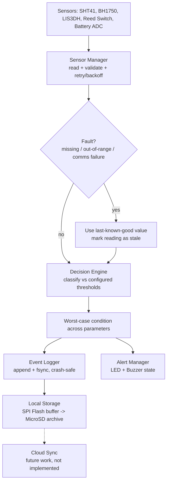
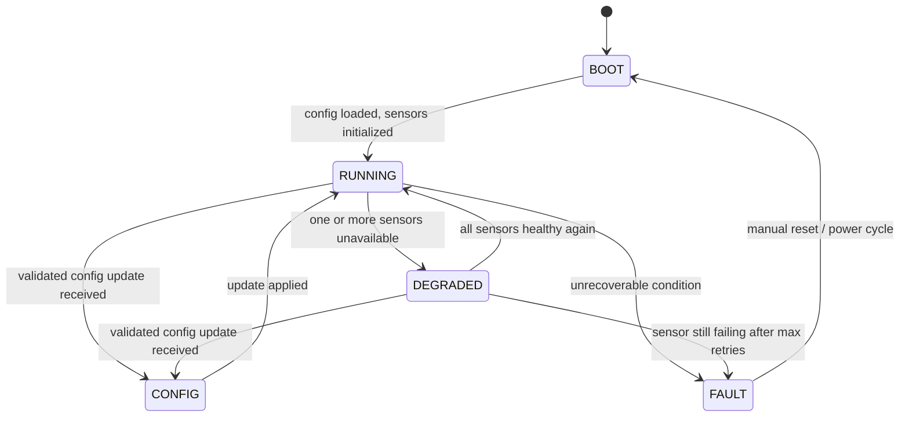

# Firmware Architecture

## Overview

The firmware is organized as a small set of single-responsibility modules
coordinated by a top-level device orchestrator and a device-level state
machine. This mirrors standard embedded practice: hardware-facing code
(sensor drivers) is isolated behind a stable interface so the decision
logic, alerting, logging and configuration code can be developed, tested
and demonstrated independently of the physical board — which is exactly
what the accompanying software simulation in [`/firmware`](../firmware)
does (see [`firmware/README.md`](../firmware/README.md) for how to run it).

## Module Breakdown

| Module | Responsibility | Production hardware mapping |
|---|---|---|
| **Sensor Manager** | Periodic reads, range validation, retry/backoff, last-known-good fallback, per-sensor health tracking | I2C driver calls to SHT41 / BH1750 / LIS3DH, GPIO read for reed switch, ADC read for battery divider |
| **Decision Engine** | Classifies each parameter against configured thresholds (Normal/Warning/Critical), takes the worst case across parameters, raises FAULT when required data is missing | Pure logic, no hardware dependency |
| **Device State Machine** | Tracks device-level operating state independent of environmental condition: BOOT, RUNNING, DEGRADED, FAULT, CONFIG | Pure logic, no hardware dependency |
| **Event Logger** | Crash-safe append-only event history; durability guarantee against power loss | External SPI Flash (short-term buffer) + Industrial MicroSD (long-term archive) |
| **Alert Manager** | Derives LED colour / buzzer on-off from the current condition | RGB LED + Active Buzzer GPIO outputs |
| **Config Manager** | Loads, validates, and persists operational configuration; applies runtime updates without dropping unrelated settings | ESP32 NVS (Non-Volatile Storage) partition |
| **Device (orchestrator)** | Wires all modules together and runs the periodic sample -> classify -> log -> alert cycle | `app_main()` / firmware entry point |

## Data Flow

## Device State Machine

Design intent: the device favours staying alive in a reduced-confidence
mode (DEGRADED) over stopping outright, because for a monitoring device
silence is worse than a degraded reading — an operator can act on "this
data might be a few minutes old" but cannot act on no data at all.

## Reliability & Error Handling

- **Sensor read failures**: each sensor read is retried with backoff
  (configurable, default 3 attempts). After the configured number of
  consecutive failures, the sensor is marked unavailable and the device
  transitions to `DEGRADED`.
- **Last-known-good fallback**: while a sensor is failing, the last
  successfully read value is still reported, explicitly flagged `stale`,
  so classification can continue without inventing data. A stale
  reading can never classify as better than `WARNING`, since its
  accuracy can no longer be vouched for.
- **Missing data with no history**: if a sensor has never produced a
  valid reading (e.g. failure right after boot), the condition is
  `FAULT` rather than a guessed value.
- **Config validation**: any configuration update — local or remote — is
  validated against schema/range rules *before* being applied; a failed
  validation leaves the previous configuration untouched. Partial
  updates are deep-merged so an update to one threshold field (e.g. the
  warning band) cannot silently erase a sibling field (e.g. the normal
  band) it didn't intend to touch.
- **Power loss durability**: every event is written with an explicit
  flush + fsync before the write is considered complete, so a power cut
  can lose at most the one in-flight write, never previously committed
  history. On restart, the event log is read back intact and a
  `power_restart` event is appended, giving a durable audit trail
  across power cycles.
- **Corrupt configuration on boot**: if the persisted configuration file
  is unreadable or fails validation, the device reverts to known-safe
  defaults and continues booting rather than refusing to start.

## Event Types Logged

| Event | Trigger |
|---|---|
| `power_restart` | Device boot |
| `state_transition` | Any device state machine transition |
| `sensor_failure` | A sensor read attempt failed after retries |
| `warning_event` / `critical_event` / `fault_event` | Decision engine reports a non-normal condition |
| `configuration_change` | A validated config update was applied |

## Why this structure

- **Testability without hardware**: because sensor access is fully
  behind the Sensor Manager interface, the decision engine, state
  machine, logger, and config manager are unit-testable in isolation
  (see `firmware/tests/test_core.py`) and the whole pipeline can be
  demonstrated in software (Option B) before hardware is available.
- **Worst-case-wins classification**: monitoring multiple parameters
  (temperature, humidity, battery) with a single "worst case decides"
  rule keeps the alerting logic simple and conservative, which matters
  for a safety-relevant cold-chain application — a single overheating
  parameter should never be masked by other parameters being fine.
- **Separation of device state from environmental condition**: keeping
  `DeviceState` (is the device itself healthy) separate from `Condition`
  (is the monitored environment healthy) avoids conflating "the ESP32
  can't talk to its sensor" with "the cargo temperature is dangerous" —
  they require different operator responses.
