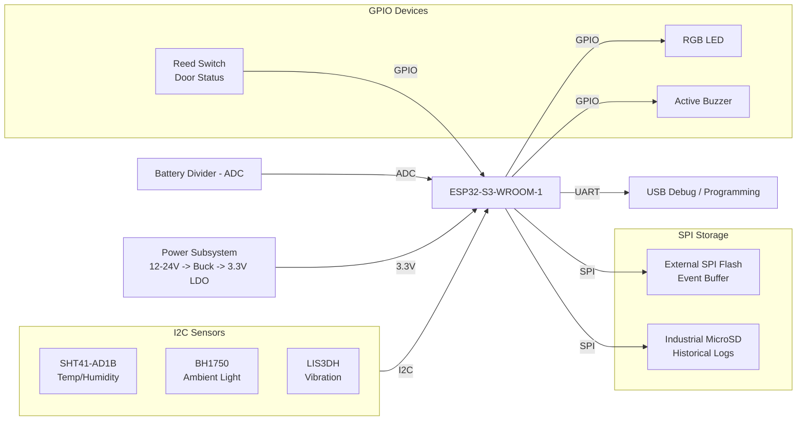

# Hardware Design

## Block Diagram

Diagram source (editable): [`../diagrams/Hardware_Block_Diagram.drawio`](../diagrams/Hardware_Block_Diagram.drawio) · Rendered image: [`Hardware_Block_Diagram.png`](../hardware/Hardware_Block_Diagram.png)

## 1. Microcontroller Selection

### Selected Component
ESP32-S3-WROOM-1

### Justification

The ESP32-S3-WROOM-1 was selected as the primary processing unit because it provides an excellent balance between processing capability, connectivity, and scalability.

Key reasons for selecting this microcontroller include:

- Dual-core Xtensa LX7 processor for concurrent task execution.
- Integrated Wi-Fi and Bluetooth for future cloud connectivity.
- Large Flash and PSRAM options suitable for event logging and firmware expansion.
- Native FreeRTOS support.
- Wide community support and mature software ecosystem.
- Suitable operating temperature (-40°C to +85°C).

Although cloud connectivity is not implemented in the MVP, the integrated wireless capability allows future support for MQTT, OTA firmware updates, and remote monitoring without major hardware redesign.

## 2. Environmental Sensor

### Selected Component
Sensirion SHT41-AD1B

### Interface
I²C

### Justification
The SHT41-AD1B was selected because it provides high measurement accuracy, factory calibration, and an integrated heater that improves reliability in high-humidity and condensation-prone environments. These characteristics make it suitable for refrigerated transport monitoring where accurate environmental measurements are critical.

## 3. Power Subsystem

### Input Supply
12V / 24V DC vehicle power

### Selected Components

- Resettable PTC Fuse
- P-Channel MOSFET Reverse Polarity Protection
- SMBJ33A TVS Diode
- LM2596HV Buck Converter
- 3.3V Low-Dropout Regulator

### Design Rationale

The power subsystem is designed to operate from common vehicle power sources while protecting the electronics from overcurrent, reverse polarity, and transient voltage events. A high-efficiency buck converter minimizes heat generation, while a dedicated 3.3V regulator provides a stable supply for the ESP32-S3 and sensors.

## 4. Local Storage & Event Logging

### Storage Architecture

The device uses a hybrid storage architecture to balance reliability, endurance, and storage capacity.

- ESP32 NVS stores configuration parameters and system settings.
- External SPI Flash stores temporary event data and acts as a buffer if the SD card is unavailable.
- An industrial-grade MicroSD card stores long-term historical logs.

### Design Rationale

This approach minimizes wear on internal flash memory while providing sufficient storage for long-duration deployments. Separating configuration, buffering, and historical logging improves reliability and supports future scalability.

## 5. Alert & User Interface

### Visual Indicator
- Standard RGB LED
- Indicates Normal, Warning, Critical, and Fault states.

### Audible Alert
- 5V Active Piezo Buzzer
- Activated during critical alarms and system faults.

### Debug Interface
- USB Serial interface provided by the ESP32-S3 development board.
- Used for firmware upload, diagnostics, and event log extraction.

### Local Display
No dedicated display is included in the MVP. Local status is communicated through LED and buzzer indications, while detailed diagnostics are available through the serial interface. This reduces hardware complexity, power consumption, and environmental exposure while remaining compliant with the assignment requirements.

## 6. Optional Sensors

### Door Status
- Component: Magnetic Reed Switch
- Interface: GPIO Digital Input
- Purpose: Detects container door opening and provides context for environmental changes.

### Battery Voltage Monitoring
- Method: Resistive Voltage Divider
- Interface: ESP32 ADC
- Purpose: Monitors supply voltage and detects low-power conditions.

### Light Detection
- Component: BH1750 Digital Ambient Light Sensor
- Interface: I²C
- Purpose: Detects unexpected light inside the container, indicating possible unauthorized access.

### Vibration Monitoring
- Component: LIS3DH 3-Axis Accelerometer
- Interface: I²C
- Purpose: Detects excessive vibration and shock during transportation, supporting diagnostics and future predictive maintenance.

## Power Flow

The device is designed to operate from a 12V or 24V vehicle power supply.

Power Flow:

12V/24V Vehicle Input
↓
Protection Circuit
↓
LM2596HV Buck Converter (5V)
↓
3.3V LDO Regulator
↓
ESP32-S3 + Sensors

The protection circuit includes:

- Resettable PTC Fuse
- Reverse Polarity MOSFET
- TVS Diode

This architecture improves efficiency while protecting the electronics from common automotive electrical faults.