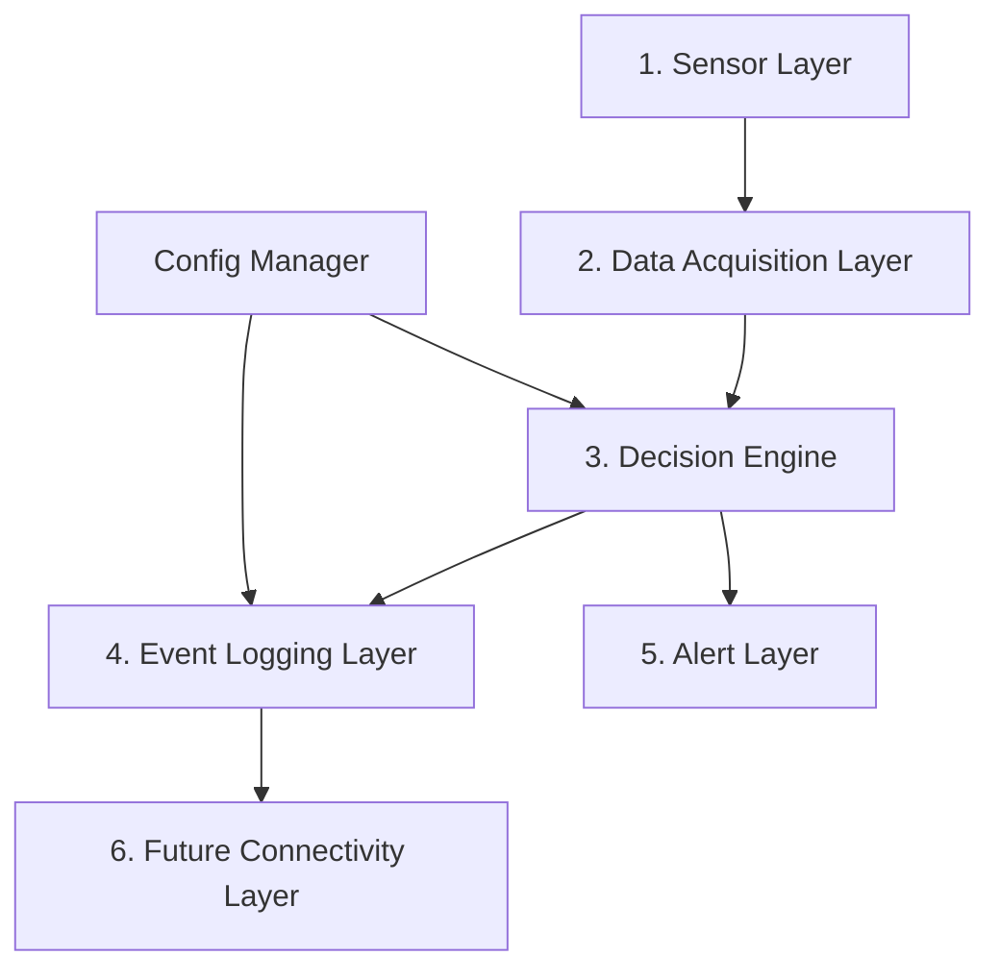

# System Architecture

## Layered View

Diagram source (editable): [`../diagrams/System_Architecture.drawio`](../diagrams/System_Architecture.drawio)

## 1. Sensor Layer

Responsible for collecting environmental and operational data from all connected sensors.

---

## 2. Data Acquisition Layer

Handles communication with hardware peripherals (I²C, SPI, ADC, GPIO), validates sensor readings, and converts raw measurements into engineering values.

---

## 3. Decision Engine

Processes validated sensor data and classifies system conditions into:

- Normal
- Warning
- Critical
- Fault

This layer also generates events whenever abnormal conditions are detected.

---

## 4. Event Logging Layer

Stores configuration, periodic measurements, and critical events using the selected hybrid storage architecture.

---

## 5. Alert Layer

Provides immediate local notifications using the RGB LED and active buzzer.

---

## 6. Future Connectivity Layer

Provides an abstraction for future integration with MQTT, Wi-Fi, Ethernet, or cellular communication without affecting the core firmware architecture.

---

## Related Diagrams

- Module-level data flow: [`../diagrams/Data_Flow.drawio`](../diagrams/Data_Flow.drawio) (also embedded as Mermaid in [`Firmware_Architecture.md`](Firmware_Architecture.md))
- Hardware block diagram: [`../diagrams/Hardware_Block_Diagram.drawio`](../diagrams/Hardware_Block_Diagram.drawio) and [`../hardware/Hardware_Block_Diagram.png`](../hardware/Hardware_Block_Diagram.png)
- Firmware module breakdown and state machine: [`Firmware_Architecture.md`](Firmware_Architecture.md)